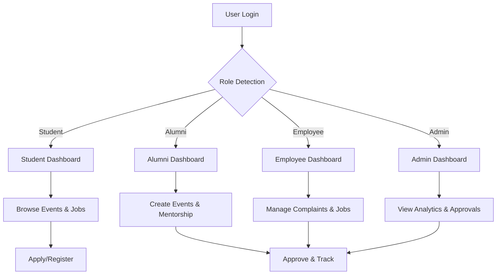

# Alumni Data Management Platform - Smart India Hackathon Project Report

## 1. Detailed Explanation of the Proposed Solution

The Alumni Data Management Platform is a web-based solution designed to seamlessly connect students, alumni, university employees, and administrators. It acts as a centralized hub for managing alumni data, facilitating mentorship, job opportunities, event participation, and community engagement.

The platform provides role-based dashboards tailored to each user type, enabling personalized experiences. It integrates gamification elements to boost engagement and uses AI-powered recommendations to connect users with relevant opportunities.

By digitizing and unifying alumni data management, the platform addresses the inefficiencies of traditional systems, enabling real-time communication, streamlined event management, and enhanced career support.

## 2. How It Addresses the Problem

Traditional alumni management suffers from fragmented communication, lack of mentorship access, and inefficient event coordination. This platform directly tackles these issues by:

- Providing a unified database accessible to all stakeholders with role-based permissions.
- Enabling students to connect with alumni mentors based on career interests.
- Streamlining event creation, registration, and tracking for employees and alumni.
- Offering job postings and application tracking to bridge students and employers.
- Using gamification to incentivize participation and maintain long-term engagement.

For example, a student seeking internship guidance can easily find and connect with an alumnus working in their desired industry, while administrators can monitor event attendance and platform usage in real time.

## 3. Innovation and Uniqueness of the Solution

- **Multi-Role Support:** Unlike many platforms focusing solely on alumni-student interaction, this solution supports students, alumni, employees, and admins with customized dashboards and features.
- **AI-Powered Recommendations:** Personalized suggestions for events, jobs, and mentorship based on user behavior and preferences.
- **Gamification:** Points, badges, and leaderboards encourage active participation and foster a vibrant community.
- **Blockchain Credential Verification:** Ensures authenticity of alumni credentials, enhancing trust.
- **Real-Time Analytics:** Provides administrators with actionable insights into platform engagement and performance.

## 4. Technologies to be Used

- **Programming Languages:** TypeScript, JavaScript
- **Frontend Framework:** React with Vite build tool
- **Styling:** Tailwind CSS
- **Routing:** React Router
- **Data Visualization:** Recharts
- **Icons:** Lucide React
- **Linting and Formatting:** ESLint, Prettier
- **AI Integration:** (Planned) AI recommendation engine
- **Blockchain:** (Planned) Credential verification module
- **Database:** (Future) MongoDB/PostgreSQL
- **Development Environment:** Node.js, cross-platform browsers

## 5. Methodology and Process for Implementation

### Step-by-Step Methodology

1. **Requirement Gathering:** Identify user roles and core features.
2. **System Design:** Architect role-based access and component structure.
3. **Frontend Development:** Build UI components, authentication, and dashboards.
4. **Feature Implementation:** Develop event management, job portal, mentorship, complaints, and gamification.
5. **Integration & Testing:** Combine modules, test responsiveness and cross-browser compatibility.
6. **Deployment:** Prepare for production deployment and future backend integration.

### Flow Chart (Mermaid Code)

## 6. Analysis of the Feasibility of the Idea

- **Technical Feasibility:** Uses proven web technologies (React, TypeScript) with scalable architecture.
- **Scalability:** Modular design allows easy addition of features and backend integration.
- **Cost:** Open-source tools minimize development cost; cloud hosting can be optimized.
- **Sustainability:** Community engagement via gamification ensures long-term platform use.

## 7. Potential Challenges and Risks

- **Technical:** Integration of AI and blockchain modules may require specialized expertise.
- **Financial:** Funding for backend infrastructure and maintenance.
- **Adoption:** User onboarding and continuous engagement.

## 8. Strategies for Overcoming Challenges

- Collaborate with AI and blockchain experts or use third-party APIs.
- Seek sponsorships or grants for infrastructure costs.
- Implement user training and feedback loops to improve adoption.

## 9. Potential Impact on the Target Audience

- **Students:** Access to mentorship, jobs, and events improves career prospects.
- **Alumni:** Opportunities to give back and stay connected.
- **University Employees:** Streamlined management of events and complaints.
- **Administrators:** Data-driven insights for better decision-making.

## 10. Benefits of the Solution

- Enhances social and professional networking.
- Boosts employability and skill development.
- Promotes transparency and accountability.
- Encourages lifelong engagement with the alma mater.

## 11. References and Research Work

- [Alumni Management Systems - Research Paper](https://example.com/alumni-management-research)
- [React Documentation](https://reactjs.org/docs/getting-started.html)
- [Tailwind CSS Guide](https://tailwindcss.com/docs)
- [Blockchain Credential Verification](https://example.com/blockchain-credentials)
- [AI Recommendation Systems](https://example.com/ai-recommendation)

---

*This document serves as a comprehensive overview of the proposed solution for the Smart India Hackathon project report.*
